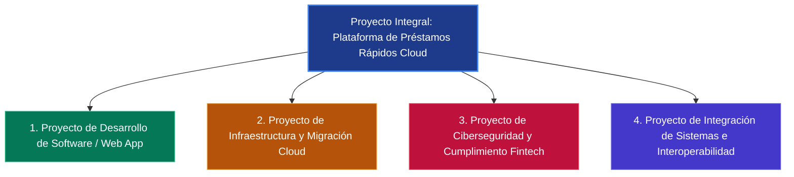
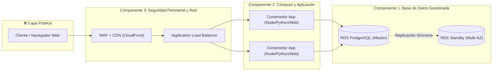
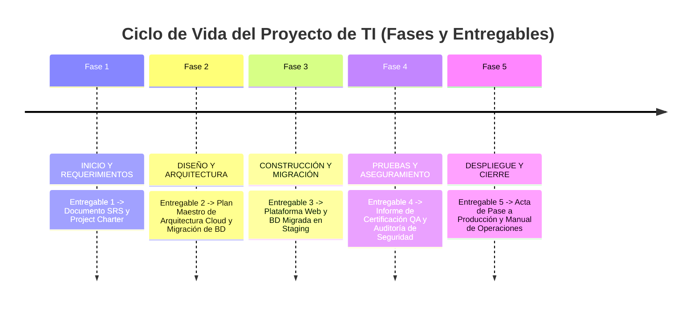

# TRABAJO ENCARGADO: PLATAFORMA WEB DE PRÉSTAMOS RÁPIDOS Y MIGRACIÓN DE BASE DE DATOS A LA NUBE

**Carrera / Especialidad:** Ingeniería de Sistemas e Informática / Tecnologías de la Información  
**Curso:** Gestión de Proyectos de TI / Arquitectura de Software y Cloud Computing  
**Proyecto:** *Desarrollo de Solución Web Fintech de Préstamos Rápidos y Plan de Migración de Base de Datos Local (On-Premise) a la Nube (AWS/Azure/GCP)*  
**Fecha de Entrega:** 2026  

---

## ÍNDICE GENERAL
1. [Resumen Ejecutivo del Proyecto](#1-resumen-ejecutivo-del-proyecto)
2. [Clasificación de los Tipos de Proyectos de TI Involucrados](#2-clasificación-de-los-tipos-de-proyectos-de-ti-involucrados)
3. [Identificación y Justificación de 3 Componentes Clave de Infraestructura](#3-identificación-y-justificación-de-3-componentes-clave-de-infraestructura)
4. [Matriz de Roles, Responsabilidades (RACI) y Asignación de la Primera Tarea](#4-matriz-de-roles-responsabilidades-raci-y-asignación-de-la-primera-tarea)
5. [Esquema del Ciclo de Vida del Proyecto (1 Entregable Clave por Fase)](#5-esquema-del-ciclo-de-vida-del-proyecto-1-entregable-clave-por-fase)
6. [Estrategia Técnica de Migración de Base de Datos (Estrategia 6R)](#6-estrategia-técnica-de-migración-de-base-de-datos-estrategia-6r)
7. [Diagrama de Arquitectura de Solución y Flujo de Datos](#7-diagrama-de-arquitectura-de-solución-y-flujo-de-datos)
8. [Conclusiones y Recomendaciones Técnicas](#8-conclusiones-y-recomendaciones-técnicas)

---

## 1. RESUMEN EJECUTIVO DEL PROYECTO

El presente proyecto aborda la modernización digital del canal de colocación de créditos mediante el desarrollo de una **Plataforma Web de Préstamos Rápidos (Fintech)** y la **Migración Integral de la Base de Datos Relacional Local (On-Premise) hacia una Infraestructura Cloud Gestionada**.

El objetivo central es eliminar los cuellos de botella de disponibilidad física, garantizar alta concurrencia en la evaluación crediticia en línea, reducir el tiempo de respuesta de aprobación a menos de 60 segundos y asegurar el cumplimiento de estándares internacionales de ciberseguridad financiera (cifrado en reposo/tránsito, aislamiento de red y copias de seguridad continuas).

---

## 2. CLASIFICACIÓN DE LOS TIPOS DE PROYECTOS DE TI INVOLUCRADOS

Un proyecto de esta naturaleza no es monolítico; converge en **cuatro (4) tipologías de proyectos de TI**, categorizados según el estándar internacional del PMI (Project Management Institute) y TOGAF:



### 2.1. Proyecto de Desarrollo de Software y Aplicaciones Web (Software Development)
* **Descripción:** Construcción de la aplicación web transaccional responsiva para clientes y back-office administrativo.
* **Alcance:**
  * Interfaz de usuario (Frontend): Cotizador interactivo de préstamos (cálculo de cuotas, TCEA, amortización francesa), formulario de registro dinámico con validación de identidad.
  * Lógica de negocio (Backend): Motor de scoring crediticio preliminar, generación de contratos digitales, gestión de desembolsos y cronogramas de pago.
* **Impacto:** Canal de captación 24/7 con experiencia de usuario (UX) ágil e intuitiva.

### 2.2. Proyecto de Infraestructura y Migración Cloud (Cloud Migration & DevOps)
* **Descripción:** Transición de los activos de almacenamiento y computación locales (servidores físicos/virtuales on-premise) hacia un proveedor de nube pública (AWS, Azure o GCP).
* **Alcance:**
  * Estrategia de migración *Replatform/Rehost* de la base de datos local hacia una base de datos relacional administrada (PaaS / DBaaS).
  * Aprovisionamiento de red virtual aislada (VPC/VNet), balanceadores de carga elásticos (ALB) y contenedores para el escalado horizontal automático.
* **Impacto:** Eliminación del riesgo por caída de hardware local, tolerancia a fallos con SLA > 99.95% y respaldos automáticos.

### 2.3. Proyecto de Ciberseguridad, Privacidad y Cumplimiento Normativo (Security & Compliance)
* **Descripción:** Implementación del marco de protección de datos financieros, cifrado y controles de acceso basados en privilegios mínimos.
* **Alcance:**
  * Cifrado de datos en tránsito (TLS 1.3 / HTTPS) y en reposo (AES-256 en tablas y volúmenes de base de datos).
  * Cumplimiento de normativas bancarias/financieras (PCI-DSS para transacciones, Ley de Protección de Datos Personales, estándares OWASP Top 10).
  * Gestión de identidades y accesos (IAM) con autenticación multifactor (MFA) y segregación de funciones.
* **Impacto:** Mitigación de riesgos de fuga de datos de clientes, robo de identidad y sanciones regulatorias.

### 2.4. Proyecto de Integración de Sistemas e Interoperabilidad (API Integration)
* **Descripción:** Conexión de la plataforma con servicios externos clave mediante APIs RESTful seguras.
* **Alcance:**
  * Conexión con Burós de Crédito (Experian/Equifax) para validación de historial crediticio.
  * Pasarelas de Pago y Transferencias Interbancarias (APIs bancarias para desembolso inmediato).
  * Servicio de Notificaciones y Firma Digital (SMS OTP / Webhooks de correo transaccional).
* **Impacto:** Automatización de extremo a extremo sin intervención humana manual innecesaria.

---

## 3. IDENTIFICACIÓN Y JUSTIFICACIÓN DE 3 COMPONENTES CLAVE DE INFRAESTRUCTURA

Para garantizar alta disponibilidad, seguridad estricta y escalabilidad ante picos de demanda crediticia (campañas comerciales, fin de mes), se seleccionan tres componentes de infraestructura Cloud fundamentales:



### Componente 1: Base de Datos Relacional Gestionada en la Nube (DBaaS - PaaS)
* **Tecnología Sugerida:** *Amazon RDS para PostgreSQL / Azure Database for PostgreSQL (Multi-AZ)*.
* **Función en el Proyecto:** Almacenamiento seguro, consistente y transaccional (cumplimiento ACID) de clientes, solicitudes de préstamo, cronogramas de pagos, estados de cuenta y logs de auditoría.
* **Justificación Técnica:**
  1. **Alta Disponibilidad y Resiliencia (Multi-AZ):** Replicación síncrona automática en zonas de disponibilidad secundarias con conmutación por error (*failover*) sin pérdida de datos en caso de contingencia.
  2. **Copias de Seguridad Automatizadas y Point-In-Time Recovery (PITR):** Respaldos diarios y retención de logs de transacciones que permiten restaurar la base de datos a cualquier segundo específico de los últimos 35 días.
  3. **Seguridad y Cifrado Nativo:** Cifrado transparente con claves KMS (AES-256) tanto en reposo (datos, índices y snapshots) como en tránsito mediante SSL/TLS forzado.
  4. **Cero Mantenimiento Operativo de Hardware:** El proveedor gestiona el parchado del sistema operativo, aprovisionamiento de almacenamiento dinámico y optimización de memoria.

### Componente 2: Capa de Cómputo Elástico y Ejecución de Aplicaciones (Containers / Serverless)
* **Tecnología Sugerida:** *AWS ECS (Elastic Container Service) con AWS Fargate / Azure App Services (Docker Containers)*.
* **Función en el Proyecto:** Ejecutar los microservicios y backend de la aplicación web (cotización, evaluación, autenticación y pasarelas de pago) de manera desacoplada del frontend estático distribuido vía CDN.
* **Justificación Técnica:**
  1. **Escalabilidad Automática (Auto-scaling):** Capacidad de aumentar o disminuir instancias de cómputo en segundos en función de la carga de CPU/memoria o cantidad de solicitudes HTTP concurrentes.
  2. **Aislamiento por Contenedores:** Cada versión de la aplicación corre en un contenedor Docker inmutable, eliminando discrepancias entre entornos de desarrollo, pruebas y producción ("funciona en mi máquina").
  3. **Modelo Serverless/Gestionado (Fargate):** No requiere administrar servidores virtuales subyacentes ni parches del kernel, optimizando costos por pago por uso exacto.

### Componente 3: Red Privada Virtual Aislada, Balanceador de Carga y Seguridad Perimetral (VPC + WAF + ALB)
* **Tecnología Sugerida:** *AWS VPC (Virtual Private Cloud) con Subredes Públicas/Privadas + AWS WAF (Web Application Firewall) + Application Load Balancer (ALB)*.
* **Función en el Proyecto:** Blindar la infraestructura contra accesos no autorizados, distribuir equitativamente el tráfico de los usuarios y garantizar que la base de datos no tenga exposición a la internet pública.
* **Justificación Técnica:**
  1. **Segregación Estricta de Subredes (Arquitectura Zero Trust):** La base de datos reside en una **subred privada sin IP pública**, accesible exclusivamente por las instancias de backend autorizadas mediante Security Groups específicos.
  2. **Protección Web WAF:** Mitigación en tiempo real contra ataques cibernéticos comunes (inyecciones SQL, Cross-Site Scripting XSS, intentos de fuerza bruta y ataques DDoS).
  3. **Terminación SSL/TLS y Balanceo Inteligente:** El Application Load Balancer maneja los certificados digitales SSL/TLS, desencripta el tráfico y lo redirige con balanceo de carga continuo hacia las instancias saludables.

---

## 4. MATRIZ DE ROLES, RESPONSABILIDADES (RACI) Y ASIGNACIÓN DE LA PRIMERA TAREA

### 4.1. Definición de Roles y Asignación de la Primera Tarea

| Rol | Perfil y Especialidad | Primera Tarea Asignada (Hito de Arranque) | Entregable de la Tarea |
| :--- | :--- | :--- | :--- |
| **1. Project Manager (Líder de Proyecto / Scrum Master)** | Gestión integral de proyectos de TI, control de costos, riesgos, metodología ágil y comunicación con stakeholders. | **Elaborar y formalizar el Acta de Constitución del Proyecto (Project Charter) y el Plan de Gestión de Riesgos y Sprints.** | *Project Charter firmado y Backlog de Sprints en Jira/Trello.* |
| **2. Arquitecto Cloud / Ingeniero DevOps** | Diseño de arquitecturas de nube seguras, redes (VPC), infraestructura como código (Terraform) y CI/CD. | **Diseñar el plano de topología Cloud y aprovisionar la Red Privada (VPC, subredes públicas/privadas, Security Groups e IAM).** | *Script Terraform de aprovisionamiento de VPC y entorno base.* |
| **3. Administrador de BD (DBA / Data Engineer)** | Modelamiento de datos relacionales, optimización SQL, replicación, migración y políticas de backup. | **Ejecutar el diagnóstico y evaluación (Assessment) de la BD local: volumetría, llaves, tipos de datos y generación del dump de extracción sanitizado.** | *Reporte de Diagnóstico de BD Local y Script DDL depurado.* |
| **4. Desarrollador Full Stack / Backend & Frontend** | Desarrollo web transaccional (React/HTML5/CSS3), APIs REST seguras (Node.js/Python), lógica de cálculo financiero. | **Crear el repositorio de código base e implementar el cotizador interactivo de préstamos (Frontend UI + Cálculo de Cuotas Francés).** | *Prototipo funcional de la interfaz en repositorio Git.* |
| **5. Especialista en Seguridad de la Información / QA Tester** | Ciberseguridad defensiva, análisis de vulnerabilidades (OWASP), pruebas unitarias/integración y cumplimiento normativo. | **Definir la Matriz de Requisitos de Seguridad, Cifrado (KMS/TLS) y la suite de casos de prueba funcional para el flujo de solicitudes.** | *Documento de Políticas de Seguridad y Plan de Casos de Prueba QA.* |

---

### 4.2. Matriz RACI del Proyecto

* **R (Responsible):** Quien realiza la tarea (ejecutor).
* **A (Accountable):** Quien aprueba y rinde cuentas finales por el éxito de la tarea (dueño).
* **C (Consulted):** Quien proporciona información técnica o estratégica clave (consultado).
* **I (Informed):** Quien es notificado de los avances y resultados (informado).

| Actividades Principales del Proyecto | Project Manager | Arquitecto Cloud / DevOps | DBA / Data Engineer | Desarrollador Full Stack | QA / Seguridad |
| :--- | :---: | :---: | :---: | :---: | :---: |
| **1. Definición del Project Charter y alcance** | **A / R** | C | C | C | I |
| **2. Diseño de Arquitectura Cloud y Redes (VPC)** | I | **A / R** | C | C | C |
| **3. Evaluación, limpieza y exportación de BD local** | I | C | **A / R** | C | I |
| **4. Configuración de BD Cloud (RDS) y migración de datos** | I | C | **A / R** | C | C |
| **5. Desarrollo del Frontend (Cotizador y Formularios)** | I | I | I | **A / R** | C |
| **6. Desarrollo de APIs Backend (Lógica de créditos)** | I | C | C | **A / R** | C |
| **7. Integración de Cifrado (KMS, TLS) y WAF** | I | C | C | C | **A / R** |
| **8. Pruebas Funcionales, de Carga y Vulnerabilidad (OWASP)**| I | I | I | C | **A / R** |
| **9. Despliegue en Producción (Cutover & Go-Live)** | **A** | **R** | **R** | **R** | C |
| **10. Monitoreo Post-Lanzamiento y Cierre de Proyecto** | **A / R** | C | C | I | I |

---

## 5. ESQUEMA DEL CICLO DE VIDA DEL PROYECTO (1 ENTREGABLE CLAVE POR FASE)



---

### Fase 1: Inicio y Requerimientos (Inception & Requirements)
* **Objetivo:** Definir con claridad el alcance del negocio, la viabilidad técnica, los requisitos regulatorios y la justificación económica.
* 📌 **ENTREGABLE ÚNICO DE LA FASE:**  
  > **Documento de Especificación de Requerimientos de Software y Viabilidad Técnica (SRS - Software Requirements Specification & Project Charter)**.

---

### Fase 2: Diseño y Arquitectura Técnica (Design & Architecture)
* **Objetivo:** Diseñar la topología de nube, el modelo de datos optimizado para la nube y los prototipos de experiencia de usuario (UX/UI).
* 📌 **ENTREGABLE ÚNICO DE LA FASE:**  
  > **Plan Maestro de Arquitectura Cloud y Especificación Técnica de Migración de Base de Datos**.

---

### Fase 3: Construcción, Implementación y Migración (Build & Migration)
* **Objetivo:** Desarrollar el código de la aplicación web, aprovisionar la infraestructura en la nube y ejecutar la transferencia de los datos locales a la nube en ambiente controlado.
* 📌 **ENTREGABLE ÚNICO DE LA FASE:**  
  > **Plataforma Web Funcional Integrada con Base de Datos Migrada y Sincronizada en Entorno de Pruebas (Staging Environment)**.

---

### Fase 4: Pruebas, Aseguramiento de Calidad y Ciberseguridad (QA & Security)
* **Objetivo:** Validar que la plataforma cumpla con los estándares de rendimiento, precisión en los cálculos financieros y protección contra ataques.
* 📌 **ENTREGABLE ÚNICO DE LA FASE:**  
  > **Informe de Certificación de Pruebas Integrales de Calidad (QA) y Reporte de Auditoría de Ciberseguridad (Security & Compliance Sign-Off)**.

---

### Fase 5: Despliegue, Pase a Producción y Cierre (Deployment & Go-Live)
* **Objetivo:** Realizar la ventana de corte (*Cutover*), publicar la web de cara a los usuarios finales y transferir el sistema al equipo de operaciones de TI.
* 📌 **ENTREGABLE ÚNICO DE LA FASE:**  
  > **Acta Oficial de Pase a Producción (Go-Live Cutover Document) y Manuales de Operación / Monitoreo**.

---

## 6. ESTRATEGIA TÉCNICA DE MIGRACIÓN DE BASE DE DATOS (ESTRATEGIA 6R)

Se aplica la estrategia **Replatform (Lift, Tinker and Shift)**:

```
[BD Local On-Premise (MySQL/PostgreSQL)]
                 │
                 ▼  Paso 1: Extracción y Schema Conversion
[Script de Extracción DDL + DML Sanitizado]
                 │
                 ▼  Paso 2: Transmisión Segura (SSL/TLS / VPN)
[Amazon S3 Bucket Cifrado con KMS]
                 │
                 ▼  Paso 3: Carga y Replicación (AWS DMS / pg_restore)
[Amazon RDS PostgreSQL en Subred Privada]
                 │
                 ▼  Paso 4: Validación de Integridad (Checksums)
[Base de Datos Cloud 100% Operativa y Homologada]
```

1. **Evaluación (Assessment):** Auditoría de esquemas, tamaños de tablas, índices, constraints y dependencias.
2. **Homologación de Esquema:** Creación de tablas con tipos de datos estándar y cifrado de columnas sensibles.
3. **Carga Inicial (Full Load):** Exportación con compresión y carga inicial a la instancia Cloud (Amazon RDS).
4. **Captura de Datos Modificados (CDC - Delta Sync):** Sincronización continua de transacciones nuevas ocurridas durante la migración mediante herramientas como AWS DMS (Database Migration Service).
5. **Corte y Conmutación (Cutover):** Apuntar las cadenas de conexión (`DATABASE_URL`) de la aplicación web a la nueva instancia Cloud y verificar la integridad de checksums.

---

## 7. DIAGRAMA DE ARQUITECTURA DE SOLUCIÓN Y FLUJO DE DATOS

```
+---------------------------------------------------------------------------------------------------+
|                                        ARQUITECTURA CLOUD SEGURA                                 |
+---------------------------------------------------------------------------------------------------+
|                                                                                                   |
|   USUARIO WEB               INTERNET / CDN                      VPC (VIRTUAL PRIVATE CLOUD)       |
|  +-------------+          +-------------------+         +---------------------------------------+ |
|  |  Navegador  | -------> | AWS CloudFront    | ------> |  SUBRED PÚBLICA                       | |
|  |  (Cliente)  | HTTPS    | + AWS WAF         |         |  +---------------------------------+  | |
|  +-------------+          +-------------------+         |  | Application Load Balancer (ALB) |  | |
|                                                         |  +---------------------------------+  | |
|                                                         +-------------------|-------------------+ |
|                                                                             |                     |
|                                                         +-------------------|-------------------+ |
|                                                         |  SUBRED PRIVADA (APP LAYER)           | |
|                                                         |  +---------------------------------+  | |
|                                                         |  | AWS ECS / Fargate (Containers)  |  | |
|                                                         |  | - Web API Préstamos             |  | |
|                                                         |  | - Motor de Scoring Crediticio   |  | |
|                                                         |  +---------------------------------+  | |
|                                                         +-------------------|-------------------+ |
|                                                                             |                     |
|                                                         +-------------------|-------------------+ |
|                                                         |  SUBRED PRIVADA AISLADA (DATA LAYER)  | |
|                                                         |  +---------------------------------+  | |
|                                                         |  | AWS RDS PostgreSQL (Multi-AZ)   |  | |
|                                                         |  | [Datos Cifrados KMS AES-256]    |  | |
|                                                         |  +---------------------------------+  | |
|                                                         +---------------------------------------+ |
+---------------------------------------------------------------------------------------------------+
```

---

## 8. CONCLUSIONES Y RECOMENDACIONES TÉCNICAS

1. **Impacto en el Negocio:** La migración a la nube y el desarrollo de la plataforma web automatizada reducen el tiempo de evaluación de préstamos de días a minutos, ofreciendo una disponibilidad del 99.95%.
2. **Eficiencia de Costos (OpEx vs. CapEx):** Al sustituir servidores físicos locales por servicios PaaS (RDS) y Cómputo elástico, se eliminan los costos de mantenimiento de hardware, licencias sobredimensionadas y energía eléctrica en sitio.
3. **Gobernanza de Seguridad:** La configuración de subredes privadas aisladas y cifrado KMS cumple con los estándares regulatorios exigidos a las plataformas de tecnología financiera (Fintech).

---
*Fin del Documento Técnico.*
